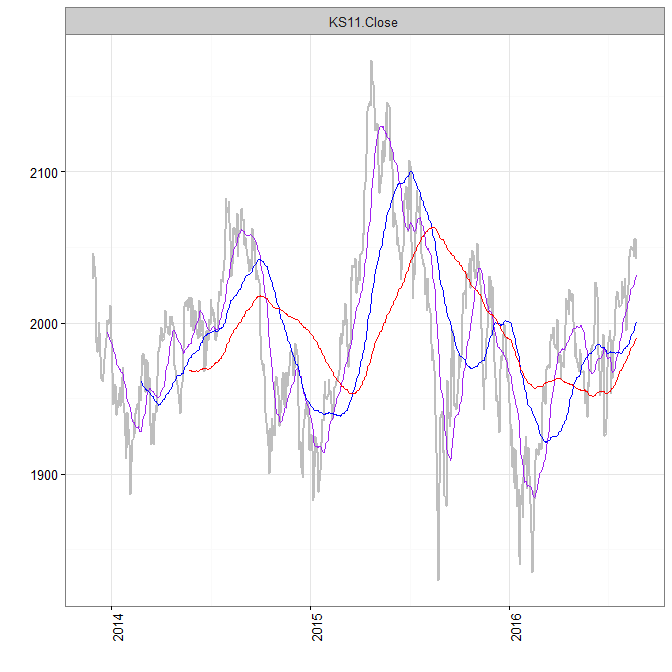
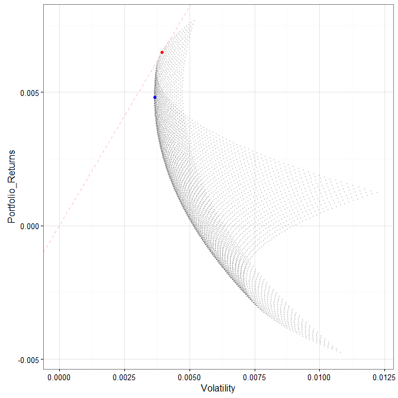

# Readme


# install `kyoboLT` package


```r
devtools::install_github("lovetoken/kyoboLT")
```

# Useful functions for time series data

## `Xday_returns()`


```r
index <- matrix(rnorm(60,1000, 8^2), 20, 3)
data <- xts(round(index, 1), as.Date(16001:16020)) # xts package for time series data
names(data) <- paste("Fund", 1:3, sep="_")
data
```

```
##            Fund_1 Fund_2 Fund_3
## 2013-10-23  913.2 1062.4  936.2
## 2013-10-24  921.8 1008.0 1112.1
## 2013-10-25 1054.9  938.8 1144.8
## 2013-10-26  941.4  928.0 1038.4
## 2013-10-27 1001.0 1067.7 1067.3
## 2013-10-28  998.9  988.3  974.5
## 2013-10-29 1054.5 1109.8 1051.7
## 2013-10-30  907.7 1070.5  980.3
## 2013-10-31 1055.2  877.1  968.8
## 2013-11-01  923.2  973.2  963.7
## 2013-11-02  987.8 1047.1 1083.8
## 2013-11-03 1030.9 1003.0 1029.2
## 2013-11-04  983.2  957.9  927.9
## 2013-11-05 1032.7 1016.2 1090.6
## 2013-11-06  929.4 1107.8  945.3
## 2013-11-07 1000.8 1132.1 1155.5
## 2013-11-08 1016.6 1067.7  969.7
## 2013-11-09  998.3  951.5  923.2
## 2013-11-10  993.5  972.1 1047.3
## 2013-11-11 1019.8 1110.1 1137.1
```

```r
# basic 3 day returns
Xday_returns(data, Xday = 3)
```

```
##                  Fund_1       Fund_2       Fund_3
## 2013-10-26  0.030880420 -0.126506024  0.109164708
## 2013-10-27  0.085918854  0.059226190 -0.040284147
## 2013-10-28 -0.053085601  0.052726885 -0.148759609
## 2013-10-29  0.120140217  0.195905172  0.012808166
## 2013-10-30 -0.093206793  0.002622459 -0.081514101
## 2013-10-31  0.056361998 -0.112516442 -0.005849153
## 2013-11-01 -0.124513988 -0.123085241 -0.083674052
## 2013-11-02  0.088245015 -0.021858944  0.105579925
## 2013-11-03 -0.023028810  0.143541215  0.062345169
## 2013-11-04  0.064991334 -0.015721332 -0.037148490
## 2013-11-05  0.045454545 -0.029510075  0.006274220
## 2013-11-06 -0.098457658  0.104486540 -0.081519627
## 2013-11-07  0.017900732  0.181856144  0.245285052
## 2013-11-08 -0.015590200  0.050679000 -0.110856409
## 2013-11-09  0.074133850 -0.141090450 -0.023378822
## 2013-11-10 -0.007294165 -0.141330271 -0.093639117
## 2013-11-11  0.003147747  0.039711529  0.172630711
```

```r
# calculation 3 day log returns
Xday_returns(data, Xday = 3, log.returns = T)
```

```
##                  Fund_1       Fund_2       Fund_3
## 2013-10-26  0.030413214 -0.135254046  0.103607217
## 2013-10-27  0.082426499  0.057538633 -0.041118025
## 2013-10-28 -0.054546581  0.051383831 -0.161060709
## 2013-10-29  0.113453871  0.178903365  0.012726836
## 2013-10-30 -0.097840852  0.002619027 -0.085028727
## 2013-10-31  0.054830928 -0.119365284 -0.005866327
## 2013-11-01 -0.132976104 -0.131345487 -0.087383139
## 2013-11-02  0.084566321 -0.022101391  0.100370016
## 2013-11-03 -0.023298115  0.134129777  0.060478888
## 2013-11-04  0.062966662 -0.015846223 -0.037856074
## 2013-11-05  0.044451763 -0.029954258  0.006254619
## 2013-11-06 -0.103648269  0.099380558 -0.085034743
## 2013-11-07  0.017742401  0.167086206  0.219364461
## 2013-11-08 -0.015713006  0.049436622 -0.117496537
## 2013-11-09  0.071514616 -0.152091659 -0.023656442
## 2013-11-10 -0.007320897 -0.152370914 -0.098317727
## 2013-11-11  0.003142804  0.038943299  0.159249695
```

```r
# not omit about start time index
Xday_returns(data, Xday = 3, start.omit = F)
```

```
##                  Fund_1       Fund_2       Fund_3
## 2013-10-23           NA           NA           NA
## 2013-10-24           NA           NA           NA
## 2013-10-25           NA           NA           NA
## 2013-10-26  0.030880420 -0.126506024  0.109164708
## 2013-10-27  0.085918854  0.059226190 -0.040284147
## 2013-10-28 -0.053085601  0.052726885 -0.148759609
## 2013-10-29  0.120140217  0.195905172  0.012808166
## 2013-10-30 -0.093206793  0.002622459 -0.081514101
## 2013-10-31  0.056361998 -0.112516442 -0.005849153
## 2013-11-01 -0.124513988 -0.123085241 -0.083674052
## 2013-11-02  0.088245015 -0.021858944  0.105579925
## 2013-11-03 -0.023028810  0.143541215  0.062345169
## 2013-11-04  0.064991334 -0.015721332 -0.037148490
## 2013-11-05  0.045454545 -0.029510075  0.006274220
## 2013-11-06 -0.098457658  0.104486540 -0.081519627
## 2013-11-07  0.017900732  0.181856144  0.245285052
## 2013-11-08 -0.015590200  0.050679000 -0.110856409
## 2013-11-09  0.074133850 -0.141090450 -0.023378822
## 2013-11-10 -0.007294165 -0.141330271 -0.093639117
## 2013-11-11  0.003147747  0.039711529  0.172630711
```

## `assess_returns()`


```r
returns <- Xday_returns(data, Xday=3, log.returns = T)

assess_returns(returns, "mean")
```

```
##   Rank  Names  Value
## 1    1 Fund_1  0.77%
## 2    2 Fund_2  0.12%
## 3    3 Fund_3 -0.48%
```

```r
assess_returns(returns, "sd")
```

```
##   Rank  Names  Value
## 1    1 Fund_1  7.20%
## 2    2 Fund_3 10.40%
## 3    3 Fund_2 11.05%
```

```r
assess_returns(returns, "S.R")
```

```
##   Rank  Names  Value
## 1    1 Fund_1 10.63%
## 2    2 Fund_2  1.12%
## 3    3 Fund_3 -4.57%
```

## `tmplot()`


```r
library("quantmod")
data <- getSymbols("^ks11", from=Sys.Date()-1000, to=Sys.Date(), auto.assign=F)

tmplot(data)
```


```r
tm1plot(data, "KS11.Close")
```



## `mvp()`


```r
mvp(returns)
```



```
##     Fund_1 Fund_2 Fund_3 Portfolio_Returns  Volatility Sharpe_Ratio
## 901   0.64   0.27   0.09       0.004807742 0.003664274     1.312059
## 19    0.82   0.18   0.00       0.006501887 0.003947271     1.647185
##                         Method Point_color
## 901 Minimum Variance Portfolio        blue
## 19            Market Portfolio         red
```
