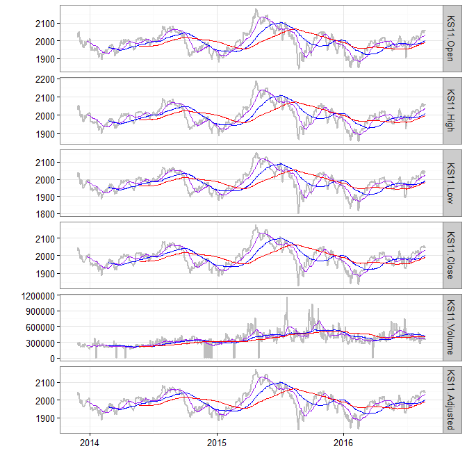

# Readme


# install `kyoboLT` package


```r
devtools::install_github("lovetoken/kyoboLT")
```

# Useful functions for time series data

## `Xday_returns()`


```r
index <- matrix(rnorm(60,1000, 8^2), 20, 3)
data <- xts(round(index, 1), as.Date(16001:16020)) # xts package for time series data
names(data) <- paste("Fund", 1:3, sep="_")
data %>% kable
```


 Fund_1   Fund_2   Fund_3
-------  -------  -------
 1077.7    981.8   1042.1
  963.5    985.5   1031.7
 1101.3    996.0   1052.7
  996.7    901.0   1019.7
 1085.9    980.4    970.7
  945.7    864.4   1004.6
  990.1   1080.6   1006.2
 1079.9    979.0    979.8
  976.1    972.9    972.7
 1032.0    990.4    951.9
  926.5    954.6    969.0
 1042.7    931.8    975.6
 1051.0    984.6   1036.1
 1044.2    993.9   1109.4
  971.4   1039.5    935.2
  857.0   1003.5   1018.1
 1010.9    944.2   1054.4
 1036.0    974.8    861.0
 1011.9   1017.1    967.6
  981.3   1009.4    988.9

```r
# basic 3 day returns
Xday_returns(data, Xday=3) %>% kable
```

       Fund_1         Fund_2         Fund_3
-------------  -------------  -------------
           NA             NA             NA
           NA             NA             NA
           NA             NA             NA
 -0.075160063   -0.082297820   -0.021495058
  0.127036845   -0.005175038   -0.059125715
 -0.141287569   -0.132128514   -0.045692030
 -0.006621852    0.199334073   -0.013239188
 -0.005525371   -0.001427989    0.009374678
  0.032145501    0.125520592   -0.031753932
  0.042318958   -0.083472145   -0.053965414
 -0.142050190   -0.024923391   -0.011022658
  0.068230714   -0.042244835    0.002981392
  0.018410853   -0.005856220    0.088454670
  0.127037237    0.041169076    0.144891641
 -0.068380167    0.115582743   -0.041410414
 -0.184586108    0.019195612   -0.017372840
 -0.031890442   -0.050005031   -0.049576348
  0.066501956   -0.062241462   -0.079341317
  0.180746791    0.013552566   -0.049602200
 -0.029280839    0.069053167   -0.062120637

```r
# calculation 3 day log returns
Xday_returns(data, Xday=3, log.returns = T) %>% kable
```

       Fund_1         Fund_2         Fund_3
-------------  -------------  -------------
           NA             NA             NA
           NA             NA             NA
           NA             NA             NA
 -0.078134598   -0.085882364   -0.021729442
  0.119591927   -0.005188475   -0.060945745
 -0.152321185   -0.141711633   -0.046768840
 -0.006643874    0.181766464   -0.013327607
 -0.005540692   -0.001429009    0.009331008
  0.031639646    0.118245677   -0.032269021
  0.041447998   -0.087162819   -0.055476151
 -0.153209678   -0.025239238   -0.011083857
  0.066003742   -0.043163103    0.002976956
  0.018243425   -0.005873435    0.084758956
  0.119592275    0.040344193    0.135309996
 -0.070830452    0.109376908   -0.042292256
 -0.204059452    0.019013701   -0.017525519
 -0.032410019   -0.051298590   -0.050847444
  0.064384093   -0.064262786   -0.082665906
  0.166147112    0.013461551   -0.050874645
 -0.029718079    0.066773366   -0.064133949

## `assess_returns()`


```r
returns <- Xday_returns(data, Xday=3, log.returns = T)

assess_returns(returns, "mean") %>% kable
```


 Rank  Names       mean
-----  -------  -------
    1  Fund_2     0.22%
    2  Fund_1    -0.62%
    3  Fund_3    -1.87%

```r
assess_returns(returns, "sd") %>% kable
```


 Rank  Names         sd
-----  -------  -------
    1  Fund_3     5.52%
    2  Fund_2     8.29%
    3  Fund_1    10.26%

```r
assess_returns(returns, "S.R") %>% kable
```


 Rank  Names         S.R
-----  -------  --------
    1  Fund_2      2.68%
    2  Fund_1     -6.06%
    3  Fund_3    -33.87%

## `tmplot()`


```r
library("quantmod")
data <- getSymbols("^ks11", from=Sys.Date()-1000, to=Sys.Date(), auto.assign=F)

tmplot(data)
```



# etc functions

## `trim()`


```r
trim("  Wow!  ", method="trailing")
```

```
## [1] "  Wow!"
```

```r
trim("  Wow!  ", method="leading")
```

```
## [1] "Wow!  "
```

```r
"  Wow!  " %>% trim %>% trim(method="leading")
```

```
## [1] "Wow!"
```
