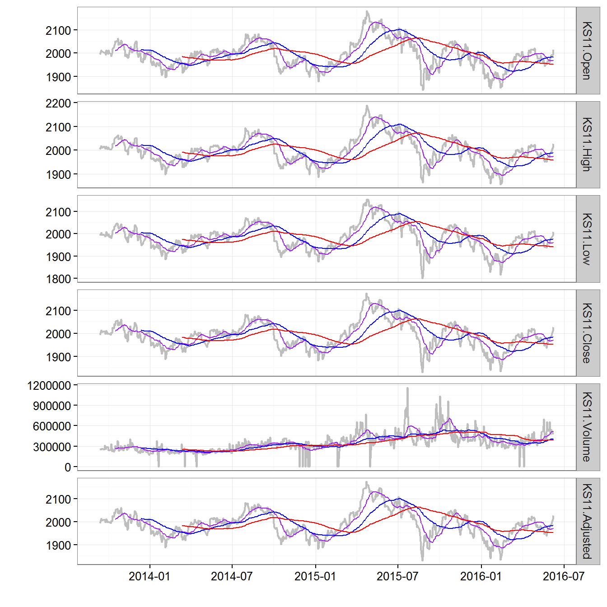

# Readme


# install `kyoboLT` package


```r
devtools::install_github("lovetoken/kyoboLT")
```

# Useful functions for time series data (using "xts" package)

## `Xday_returns()` function


```r
index <- matrix(rnorm(60,1000, 8^2), 20, 3)
data <- xts(round(index, 1), as.Date(16001:16020)) # xts package for time series data
names(data) <- paste("Fund", 1:3, sep="_")
data
```

```
##            Fund_1 Fund_2 Fund_3
## 2013-10-23  981.8 1078.9  900.7
## 2013-10-24 1063.1 1004.5 1012.0
## 2013-10-25  987.6 1032.1  974.5
## 2013-10-26 1002.9  964.6 1079.7
## 2013-10-27  944.0 1050.3 1034.9
## 2013-10-28  967.4  910.8  972.7
## 2013-10-29  937.9  872.2 1065.1
## 2013-10-30  995.1 1067.0 1111.1
## 2013-10-31  979.2  832.1  958.0
## 2013-11-01  895.5 1015.0  946.9
## 2013-11-02 1053.1  970.9 1040.4
## 2013-11-03 1107.8  963.7  980.5
## 2013-11-04  959.8 1049.8  976.6
## 2013-11-05  932.9 1061.8  959.8
## 2013-11-06 1042.0  942.7 1087.6
## 2013-11-07 1158.8  871.5  977.1
## 2013-11-08 1042.2  952.6 1088.0
## 2013-11-09 1026.9 1016.7 1018.4
## 2013-11-10 1001.1 1029.9  958.6
## 2013-11-11 1094.4 1004.8  992.0
```

```r
# basic 3 day returns
Xday_returns(data, Xday=3)
```

```
##                 Fund_1      Fund_2        Fund_3
## 2013-10-23          NA          NA            NA
## 2013-10-24          NA          NA            NA
## 2013-10-25          NA          NA            NA
## 2013-10-26  0.02149114 -0.10594124  0.1987343178
## 2013-10-27 -0.11203085  0.04559482  0.0226284585
## 2013-10-28 -0.02045362 -0.11752737 -0.0018471011
## 2013-10-29 -0.06481205 -0.09579100 -0.0135222747
## 2013-10-30  0.05413136  0.01590022  0.0736303024
## 2013-10-31  0.01219764 -0.08640755 -0.0151125732
## 2013-11-01 -0.04520738  0.16372392 -0.1109754953
## 2013-11-02  0.05828560 -0.09006560 -0.0636306363
## 2013-11-03  0.13133170  0.15815407  0.0234864301
## 2013-11-04  0.07180346  0.03428571  0.0313655085
## 2013-11-05 -0.11413921  0.09362447 -0.0774702038
## 2013-11-06 -0.05939700 -0.02179101  0.1092299847
## 2013-11-07  0.20733486 -0.16984187  0.0005119803
## 2013-11-08  0.11716154 -0.10284423  0.1335694936
## 2013-11-09 -0.01449136  0.07849793 -0.0636263332
## 2013-11-10 -0.13608906  0.18175559 -0.0189335790
## 2013-11-11  0.05008636  0.05479740 -0.0882352941
```

```r
# calculation 3 day log returns
Xday_returns(data, Xday=3, log.returns = T)
```

```
##                 Fund_1      Fund_2        Fund_3
## 2013-10-23          NA          NA            NA
## 2013-10-24          NA          NA            NA
## 2013-10-25          NA          NA            NA
## 2013-10-26  0.02126346 -0.11198377  0.1812662650
## 2013-10-27 -0.11881828  0.04458593  0.0223762328
## 2013-10-28 -0.02066570 -0.12502751 -0.0018488091
## 2013-10-29 -0.06700775 -0.10069475 -0.0136145333
## 2013-10-30  0.05271707  0.01577513  0.0710457119
## 2013-10-31  0.01212385 -0.09037071 -0.0152279319
## 2013-11-01 -0.04626111  0.15162514 -0.1176304795
## 2013-11-02  0.05665024 -0.09438277 -0.0657452610
## 2013-11-03  0.12339543  0.14682742  0.0232148677
## 2013-11-04  0.06934271  0.03371106  0.0308836606
## 2013-11-05 -0.12119546  0.08949738 -0.0806356042
## 2013-11-06 -0.06123412 -0.02203194  0.1036660671
## 2013-11-07  0.18841534 -0.18613908  0.0005118493
## 2013-11-08  0.11079113 -0.10852577  0.1253714980
## 2013-11-09 -0.01459739  0.07556927 -0.0657406655
## 2013-11-10 -0.14628559  0.16700112 -0.0191151142
## 2013-11-11  0.04887240  0.05334871 -0.0923733201
```

## `tmplot()` function


```r
library("quantmod")
data <- getSymbols("^ks11", from=Sys.Date()-1000, to=Sys.Date(), auto.assign=F)

tmplot(data)
```



# etc functions

## `trim()` function


```r
trim("  Wow!  ", method="trailing")
```

```
## [1] "  Wow!"
```

```r
trim("  Wow!  ", method="leading")
```

```
## [1] "Wow!  "
```

```r
"  Wow!  " %>% trim %>% trim(method="leading")
```

```
## [1] "Wow!"
```
