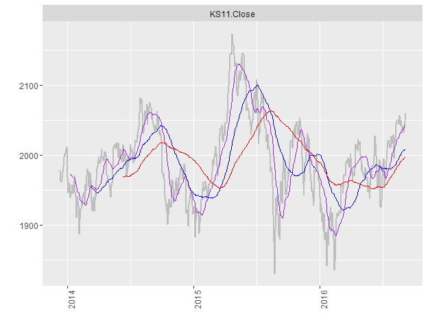
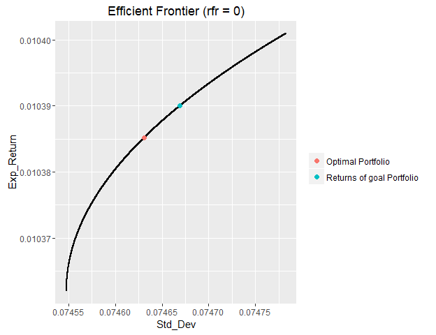

# Readme


# install `kyoboLT` package


```r
devtools::install_github("lovetoken/kyoboLT")
```

# Useful functions for time series data

## `Xday_returns()`


```r
index <- matrix(rnorm(120, 1000, 10^2), 30, 4)
data <- xts(round(index, 1), as.Date(16001:16030)) # xts package for time series data
names(data) <- paste("Fund", 1:4, sep = "_")
data
```

```
##            Fund_1 Fund_2 Fund_3 Fund_4
## 2013-10-23  938.2  891.3 1084.0  984.3
## 2013-10-24 1078.1 1060.1 1072.6  836.0
## 2013-10-25  953.4 1117.1 1170.3  971.0
## 2013-10-26  975.6 1109.6  904.9 1242.3
## 2013-10-27 1070.2  943.8 1060.3 1056.3
## 2013-10-28 1081.5  920.4  936.8  935.3
## 2013-10-29 1180.7 1133.7  894.6 1167.3
## 2013-10-30  996.0 1163.6 1020.0  881.2
## 2013-10-31  981.5  929.1 1017.2 1091.4
## 2013-11-01 1010.4 1012.0 1086.6  812.0
## 2013-11-02  977.1 1103.3 1061.2  932.4
## 2013-11-03  853.1 1141.1 1031.8 1163.7
## 2013-11-04 1082.9 1105.1  851.3 1056.0
## 2013-11-05  984.8  911.9 1030.8 1026.9
## 2013-11-06 1021.4  987.9  978.4 1080.0
## 2013-11-07 1088.8  888.1  978.4  928.0
## 2013-11-08  873.7  786.6  907.1 1154.4
## 2013-11-09  972.8 1150.9  789.8  900.2
## 2013-11-10 1130.2 1054.3 1038.6 1115.5
## 2013-11-11 1056.5 1114.9 1107.9 1210.8
## 2013-11-12  925.2  952.1  974.8  940.8
## 2013-11-13 1077.4  920.4  904.5 1038.8
## 2013-11-14 1058.3  933.9  946.8  884.1
## 2013-11-15 1137.1  968.2 1234.6 1049.8
## 2013-11-16  882.2 1145.7 1030.2  931.8
## 2013-11-17 1220.1  996.5  924.5 1064.6
## 2013-11-18 1017.3 1002.2  779.7 1019.4
## 2013-11-19 1140.3 1000.5  998.4  953.8
## 2013-11-20 1118.4  928.6  855.7  854.9
## 2013-11-21  871.7 1124.2 1199.7  967.5
```

```r
# basic 3 day returns
xdiff_returns(data, 3)
```

```
##                  Fund_1       Fund_2      Fund_3      Fund_4
## 2013-10-26  0.039863569  0.244923146 -0.16522140  0.26211521
## 2013-10-27 -0.007327706 -0.109706631 -0.01146746  0.26351675
## 2013-10-28  0.134361233 -0.176080924 -0.19952149 -0.03676622
## 2013-10-29  0.210229602  0.021719539 -0.01138247 -0.06037189
## 2013-10-30 -0.069332835  0.232888324 -0.03800811 -0.16576730
## 2013-10-31 -0.092464170  0.009452412  0.08582408  0.16689832
## 2013-11-01 -0.144236470 -0.107347623  0.21462106 -0.30437762
## 2013-11-02 -0.018975904 -0.051821932  0.04039216  0.05810259
## 2013-11-03 -0.130820173  0.228177806  0.01435313  0.06624519
## 2013-11-04  0.071753761  0.091996047 -0.21654703  0.30049261
## 2013-11-05  0.007880463 -0.173479561 -0.02864681  0.10135135
## 2013-11-06  0.197280506 -0.134256419 -0.05175422 -0.07192575
## 2013-11-07  0.005448333 -0.196362320  0.14930107 -0.12121212
## 2013-11-08 -0.112814785 -0.137405417 -0.12000388  0.12416009
## 2013-11-09 -0.047581751  0.164996457 -0.19276370 -0.16648148
## 2013-11-10  0.038023512  0.187141088  0.06152903  0.20204741
## 2013-11-11  0.209225134  0.417365878  0.22136479  0.04885655
## 2013-11-12 -0.048930921 -0.172734382  0.23423652  0.04510109
## 2013-11-13 -0.046717395 -0.127003699 -0.12911612 -0.06875840
## 2013-11-14  0.001703739 -0.162346399 -0.14541024 -0.26982161
## 2013-11-15  0.229031561  0.016909988  0.26651621  0.11585884
## 2013-11-16 -0.181176907  0.244784876  0.13897181 -0.10300347
## 2013-11-17  0.152886705  0.067030731 -0.02355302  0.20416243
## 2013-11-18 -0.105355729  0.035116711 -0.36845942 -0.02895790
## 2013-11-19  0.292564044 -0.126734747 -0.03086779  0.02361022
## 2013-11-20 -0.083353823 -0.068138485 -0.07441860 -0.19697539
## 2013-11-21 -0.143123956  0.121732189  0.53866872 -0.05091230
```

```r
# calculation 3 day log returns
xdiff_returns(data, 3, log.returns = T)
```

```
##                  Fund_1       Fund_2      Fund_3      Fund_4
## 2013-10-26  0.039089520  0.219073798 -0.18058874  0.23278905
## 2013-10-27 -0.007354686 -0.116204243 -0.01153372  0.23389890
## 2013-10-28  0.126069703 -0.193682962 -0.22254559 -0.03745913
## 2013-10-29  0.190810096  0.021487030 -0.01144775 -0.06227111
## 2013-10-30 -0.071853568  0.209359647 -0.03874926 -0.18124290
## 2013-10-31 -0.097022232  0.009408017  0.08233922  0.15434922
## 2013-11-01 -0.155761191 -0.113558049  0.19443214 -0.36294833
## 2013-11-02 -0.019158257 -0.053212959  0.03959772  0.05647729
## 2013-11-03 -0.140205240  0.205531613  0.01425110  0.06414331
## 2013-11-04  0.069296336  0.088007258 -0.24404424  0.26274312
## 2013-11-05  0.007849574 -0.190530633 -0.02906514  0.09653793
## 2013-11-06  0.180052740 -0.144166510 -0.05314154 -0.07464354
## 2013-11-07  0.005433545 -0.218606758  0.13915399 -0.12921173
## 2013-11-08 -0.119701508 -0.147810475 -0.12783778  0.11703617
## 2013-11-09 -0.048751003  0.152718046 -0.21413884 -0.18209936
## 2013-11-10  0.037318436  0.171547969  0.05971035  0.18402628
## 2013-11-11  0.189979770  0.348800134  0.19996891  0.04770057
## 2013-11-12 -0.050168581 -0.189629453  0.21045257  0.04411362
## 2013-11-13 -0.047843877 -0.135823960 -0.13824663 -0.07123653
## 2013-11-14  0.001702289 -0.177150628 -0.15713373 -0.31446640
## 2013-11-15  0.206226510  0.016768606  0.23626999  0.10962437
## 2013-11-16 -0.199887223  0.218962725  0.13012593 -0.10870328
## 2013-11-17  0.142268975  0.064879774 -0.02383483  0.18578424
## 2013-11-18 -0.111329103  0.034514185 -0.45959308 -0.02938545
## 2013-11-19  0.256627877 -0.135515929 -0.03135424  0.02333581
## 2013-11-20 -0.087033730 -0.070571064 -0.07733320 -0.21936992
## 2013-11-21 -0.154462010  0.114874088  0.43091757 -0.05225407
```

```r
# not omit about start time index
xdiff_returns(data, 3, start.omit = F)
```

```
##                  Fund_1       Fund_2      Fund_3      Fund_4
## 2013-10-23           NA           NA          NA          NA
## 2013-10-24           NA           NA          NA          NA
## 2013-10-25           NA           NA          NA          NA
## 2013-10-26  0.039863569  0.244923146 -0.16522140  0.26211521
## 2013-10-27 -0.007327706 -0.109706631 -0.01146746  0.26351675
## 2013-10-28  0.134361233 -0.176080924 -0.19952149 -0.03676622
## 2013-10-29  0.210229602  0.021719539 -0.01138247 -0.06037189
## 2013-10-30 -0.069332835  0.232888324 -0.03800811 -0.16576730
## 2013-10-31 -0.092464170  0.009452412  0.08582408  0.16689832
## 2013-11-01 -0.144236470 -0.107347623  0.21462106 -0.30437762
## 2013-11-02 -0.018975904 -0.051821932  0.04039216  0.05810259
## 2013-11-03 -0.130820173  0.228177806  0.01435313  0.06624519
## 2013-11-04  0.071753761  0.091996047 -0.21654703  0.30049261
## 2013-11-05  0.007880463 -0.173479561 -0.02864681  0.10135135
## 2013-11-06  0.197280506 -0.134256419 -0.05175422 -0.07192575
## 2013-11-07  0.005448333 -0.196362320  0.14930107 -0.12121212
## 2013-11-08 -0.112814785 -0.137405417 -0.12000388  0.12416009
## 2013-11-09 -0.047581751  0.164996457 -0.19276370 -0.16648148
## 2013-11-10  0.038023512  0.187141088  0.06152903  0.20204741
## 2013-11-11  0.209225134  0.417365878  0.22136479  0.04885655
## 2013-11-12 -0.048930921 -0.172734382  0.23423652  0.04510109
## 2013-11-13 -0.046717395 -0.127003699 -0.12911612 -0.06875840
## 2013-11-14  0.001703739 -0.162346399 -0.14541024 -0.26982161
## 2013-11-15  0.229031561  0.016909988  0.26651621  0.11585884
## 2013-11-16 -0.181176907  0.244784876  0.13897181 -0.10300347
## 2013-11-17  0.152886705  0.067030731 -0.02355302  0.20416243
## 2013-11-18 -0.105355729  0.035116711 -0.36845942 -0.02895790
## 2013-11-19  0.292564044 -0.126734747 -0.03086779  0.02361022
## 2013-11-20 -0.083353823 -0.068138485 -0.07441860 -0.19697539
## 2013-11-21 -0.143123956  0.121732189  0.53866872 -0.05091230
```

## `assess_returns()`


```r
returns <- xdiff_returns(data, 1, log.returns = T)

assess_returns(returns, "mean")
```

```
##   Rank  Names  Value
## 1    1 Fund_2  0.80%
## 2    2 Fund_3  0.35%
## 3    3 Fund_4 -0.06%
## 4    4 Fund_1 -0.25%
```

```r
assess_returns(returns, "sd")
```

```
##   Rank  Names  Value
## 1    1 Fund_2 13.52%
## 2    2 Fund_1 14.44%
## 3    3 Fund_3 15.66%
## 4    4 Fund_4 17.66%
```

```r
assess_returns(returns, "S.R")
```

```
##   Rank  Names  Value
## 1    1 Fund_2  5.92%
## 2    2 Fund_3  2.23%
## 3    3 Fund_4 -0.34%
## 4    4 Fund_1 -1.76%
```

## `tmplot()`


```r
library("quantmod")
data <- getSymbols("^ks11", from=Sys.Date()-1000, to = Sys.Date(), auto.assign = F)

tmplot(data)
```


```r
tm1plot(data, "KS11.Close")
```



## `efff()`


```r
set.seed(123)
index <- matrix(rnorm(4000, 1000, 10^2), 1000, 4)
data <- xts(round(index, 1), as.Date(16001:17000)) # xts package for time series data
names(data) <- paste("Fund", 1:4, sep = "_")
returns <- xdiff_returns(data, 1)

efff(returns, rg = 0.01039)
```



# Useful manipulation

## `mmadjust()`


```r
(x <- c(NA, 1:100*.01, NA))
```

```
##   [1]   NA 0.01 0.02 0.03 0.04 0.05 0.06 0.07 0.08 0.09 0.10 0.11 0.12 0.13
##  [15] 0.14 0.15 0.16 0.17 0.18 0.19 0.20 0.21 0.22 0.23 0.24 0.25 0.26 0.27
##  [29] 0.28 0.29 0.30 0.31 0.32 0.33 0.34 0.35 0.36 0.37 0.38 0.39 0.40 0.41
##  [43] 0.42 0.43 0.44 0.45 0.46 0.47 0.48 0.49 0.50 0.51 0.52 0.53 0.54 0.55
##  [57] 0.56 0.57 0.58 0.59 0.60 0.61 0.62 0.63 0.64 0.65 0.66 0.67 0.68 0.69
##  [71] 0.70 0.71 0.72 0.73 0.74 0.75 0.76 0.77 0.78 0.79 0.80 0.81 0.82 0.83
##  [85] 0.84 0.85 0.86 0.87 0.88 0.89 0.90 0.91 0.92 0.93 0.94 0.95 0.96 0.97
##  [99] 0.98 0.99 1.00   NA
```

```r
mmadjust(x, .2, .8)
```

```
##   [1]   NA 0.20 0.20 0.20 0.20 0.20 0.20 0.20 0.20 0.20 0.20 0.20 0.20 0.20
##  [15] 0.20 0.20 0.20 0.20 0.20 0.20 0.20 0.21 0.22 0.23 0.24 0.25 0.26 0.27
##  [29] 0.28 0.29 0.30 0.31 0.32 0.33 0.34 0.35 0.36 0.37 0.38 0.39 0.40 0.41
##  [43] 0.42 0.43 0.44 0.45 0.46 0.47 0.48 0.49 0.50 0.51 0.52 0.53 0.54 0.55
##  [57] 0.56 0.57 0.58 0.59 0.60 0.61 0.62 0.63 0.64 0.65 0.66 0.67 0.68 0.69
##  [71] 0.70 0.71 0.72 0.73 0.74 0.75 0.76 0.77 0.78 0.79 0.80 0.80 0.80 0.80
##  [85] 0.80 0.80 0.80 0.80 0.80 0.80 0.80 0.80 0.80 0.80 0.80 0.80 0.80 0.80
##  [99] 0.80 0.80 0.80   NA
```

## `trim()`


```r
trim("  Wow!  ", method = "leading")
```

```
## [1] "Wow!  "
```

```r
trim("  Wow!  ", method = "trailing")
```

```
## [1] "  Wow!"
```

```r
"  Wow!  " %>% trim %>% trim(method = "leading")
```

```
## [1] "Wow!"
```
