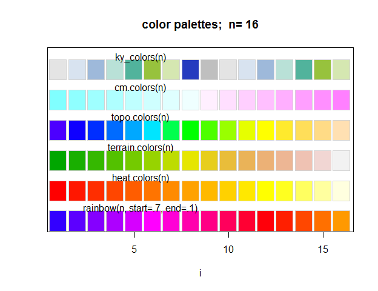
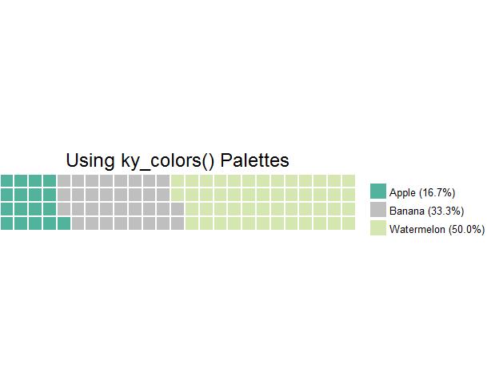

# kyoboLT package in R


**Under Construction**  
Useful R package for kyobo retirement pension marketing team.  

# Overview

본 패키지는 크게 3가지 성격을 가지고 있습니다.

1. 자료 핸들링을 위한 편의함수 : `xdiff_returns()`, `mmadjust()`, `trim()` 등
2. 시각화 템플릿을 통한 생산성 증대 : `tmplot()`, `ky_colors()`, `prop_waffle()`, `cormat()` 등
3. 분석모듈 : `efff()` 등

# Example

## `tmplot()`

시계열 자료가 있을 때 20, 50, 120일 이동평균선과 함께 플랏팅을 해줍니다.
데이터프레임일때 동작하며 단변수일 경우


```r
library("quantmod")
data <- getSymbols("^ks11", from=Sys.Date()-1000, to = Sys.Date(), auto.assign = F)[,1]

tmplot(data)
```


다변수일경우 입니다.


```r
data <- getSymbols("^ks11", from=Sys.Date()-1000, to = Sys.Date(), auto.assign = F)

tmplot(data)
```


## `xdiff_returns()`


```r
data(sample_index)

sample_index
```

```
##            Fund_1 Fund_2 Fund_3
## 2013-10-23 1048.2  955.7 1046.4
## 2013-10-24 1128.9  924.3  968.7
## 2013-10-25  977.3 1081.2  969.0
## 2013-10-26 1129.8  980.0 1118.1
## 2013-10-27  858.1 1002.0 1033.0
## 2013-10-28 1048.5  905.1  928.7
## 2013-10-29  916.4  927.9  980.2
## 2013-10-30  948.6  887.1 1005.9
## 2013-10-31  885.3  932.0 1041.2
## 2013-11-01  997.3  914.0 1024.0
## 2013-11-02 1137.6 1048.3 1012.6
## 2013-11-03  886.7  958.9 1075.6
## 2013-11-04 1055.3 1091.6  955.2
## 2013-11-05  889.9  960.0  961.2
## 2013-11-06 1008.6 1014.7  967.6
## 2013-11-07  995.1 1016.8  947.5
## 2013-11-08 1054.9 1027.5  984.9
## 2013-11-09 1022.1  905.0  950.7
## 2013-11-10  962.7 1011.5 1046.1
## 2013-11-11 1050.3 1131.9 1081.9
```

```r
xdiff_returns(sample_index)
```

```
##                 Fund_1       Fund_2        Fund_3
## 2013-10-24  0.07698912 -0.032855499 -0.0742545872
## 2013-10-25 -0.13429002  0.169750081  0.0003096934
## 2013-10-26  0.15604216 -0.093599704  0.1538699690
## 2013-10-27 -0.24048504  0.022448980 -0.0761112602
## 2013-10-28  0.22188556 -0.096706587 -0.1009680542
## 2013-10-29 -0.12598951  0.025190587  0.0554538602
## 2013-10-30  0.03513749 -0.043970255  0.0262191390
## 2013-10-31 -0.06672992  0.050614361  0.0350929516
## 2013-11-01  0.12651079 -0.019313305 -0.0165194007
## 2013-11-02  0.14067984  0.146936543 -0.0111328125
## 2013-11-03 -0.22055204 -0.085280931  0.0622160774
## 2013-11-04  0.19014323  0.138387736 -0.1119375232
## 2013-11-05 -0.15673268 -0.120556981  0.0062814070
## 2013-11-06  0.13338577  0.056979167  0.0066583437
## 2013-11-07 -0.01338489  0.002069577 -0.0207730467
## 2013-11-08  0.06009446  0.010523210  0.0394722955
## 2013-11-09 -0.03109299 -0.119221411 -0.0347243375
## 2013-11-10 -0.05811564  0.117679558  0.1003471127
## 2013-11-11  0.09099408  0.119031142  0.0342223497
```

## `efff()`

수익률을 기반으로 효율적투자선을 그려줍니다.  
이를 이용하여 최적수익률포트폴리오, 목표수익률포트폴리오에 대한 분석이 가능합니다.  


```r
returns <- xdiff_returns(sample_index, 1)
ef <- efff(returns, rg = 0.01039, rfr = 0.001, plot.only.efff = F)
```


```r
attr(ef, "poolset") %>% head
```

```
## # A tibble: 6 × 6
##      Fund_1    Fund_2    Fund_3    Std_Dev Excess_Return    sharpe
##       <dbl>     <dbl>     <dbl>      <dbl>         <dbl>     <dbl>
## 1 0.1555268 0.2575933 0.5868799 0.04790466   0.006151036 0.1284016
## 2 0.1555298 0.2576578 0.5868125 0.04790466   0.006151645 0.1284143
## 3 0.1555327 0.2577222 0.5867451 0.04790466   0.006152253 0.1284270
## 4 0.1555357 0.2577866 0.5866776 0.04790467   0.006152862 0.1284397
## 5 0.1555387 0.2578511 0.5866102 0.04790467   0.006153471 0.1284524
## 6 0.1555417 0.2579155 0.5865428 0.04790468   0.006154080 0.1284651
```

## `mmadjust()`

최대 최소값을 임의의 값으로 보정시킵니다. 
즉 임의값을 초과하는 부분이 보정됩니다.  


```r
(x <- c(NA, 1:100*.01, NA))
```

```
##   [1]   NA 0.01 0.02 0.03 0.04 0.05 0.06 0.07 0.08 0.09 0.10 0.11 0.12 0.13
##  [15] 0.14 0.15 0.16 0.17 0.18 0.19 0.20 0.21 0.22 0.23 0.24 0.25 0.26 0.27
##  [29] 0.28 0.29 0.30 0.31 0.32 0.33 0.34 0.35 0.36 0.37 0.38 0.39 0.40 0.41
##  [43] 0.42 0.43 0.44 0.45 0.46 0.47 0.48 0.49 0.50 0.51 0.52 0.53 0.54 0.55
##  [57] 0.56 0.57 0.58 0.59 0.60 0.61 0.62 0.63 0.64 0.65 0.66 0.67 0.68 0.69
##  [71] 0.70 0.71 0.72 0.73 0.74 0.75 0.76 0.77 0.78 0.79 0.80 0.81 0.82 0.83
##  [85] 0.84 0.85 0.86 0.87 0.88 0.89 0.90 0.91 0.92 0.93 0.94 0.95 0.96 0.97
##  [99] 0.98 0.99 1.00   NA
```

```r
mmadjust(x, .2, .8)
```

```
##   [1]   NA 0.20 0.20 0.20 0.20 0.20 0.20 0.20 0.20 0.20 0.20 0.20 0.20 0.20
##  [15] 0.20 0.20 0.20 0.20 0.20 0.20 0.20 0.21 0.22 0.23 0.24 0.25 0.26 0.27
##  [29] 0.28 0.29 0.30 0.31 0.32 0.33 0.34 0.35 0.36 0.37 0.38 0.39 0.40 0.41
##  [43] 0.42 0.43 0.44 0.45 0.46 0.47 0.48 0.49 0.50 0.51 0.52 0.53 0.54 0.55
##  [57] 0.56 0.57 0.58 0.59 0.60 0.61 0.62 0.63 0.64 0.65 0.66 0.67 0.68 0.69
##  [71] 0.70 0.71 0.72 0.73 0.74 0.75 0.76 0.77 0.78 0.79 0.80 0.80 0.80 0.80
##  [85] 0.80 0.80 0.80 0.80 0.80 0.80 0.80 0.80 0.80 0.80 0.80 0.80 0.80 0.80
##  [99] 0.80 0.80 0.80   NA
```

## `trim()`

정규표현식에 기반한 공백문자에 대한 trimming 을 제공합니다.  


```r
trim("  Wow!  ", method = "leading")
```

```
## [1] "Wow!  "
```

```r
trim("  Wow!  ", method = "trailing")
```

```
## [1] "  Wow!"
```

```r
"  Wow!  " %>% trim %>% trim(method = "leading")
```

```
## [1] "Wow!"
```

## `ky_colors()`

자주사용하는 색에 대한 팔레트함수입니다.  


```r
demo.pal <- function(n, border = if (n < 32) "light gray" else NA,
                     main = paste("color palettes;  n=", n),
                     ch.col = c("rainbow(n, start=.7, end=.1)", "heat.colors(n)",
                                "terrain.colors(n)", "topo.colors(n)", 
                                "cm.colors(n)", "ky_colors(n)")){
  
    nt <- length(ch.col)
    i <- 1:n; j <- n / nt; d <- j/6; dy <- 2*d
    plot(i, i+d, type = "n", yaxt = "n", ylab = "", main = main)
    
    for(k in 1:nt){
        rect(i-.5, (k-1)*j+ dy, i+.4, k*j, col = eval(parse(text = ch.col[k])), border = border)
        text(2*j,  k * j + dy/4, ch.col[k])
    }
    
}

demo.pal(n = 16)
```



## `prop_waffle()`

비율에 대한 와플차트를 제공합니다.  


```r
x <- c("Apple" = 1, "Banana" = 2, "Watermelon" = 3)
prop_waffle(x, 1, 4, size = 1)
```


```r
prop_waffle(x, 1, 4, size = 1, colors = ky_colors(3, random = T), 
            title = "Using ky_colors() Palettes")
```



## `cormat()`

상관행렬도를 시각화하며 `psych::pairs.panels()` 에 기반합니다.  


```r
cormat(cars)
```


# Install

github 원격저장소에 본 패키지 프로젝트가 담겨 있습니다.  
devtools package 의 `install_github()` 함수를 통해 설치 가능합니다.  
아래의 코드를 실행하세요.  


```r
devtools::install_github("lovetoken/kyoboLT")
```

# License

[GPL-3](https://www.gnu.org/licenses/gpl-3.0.en.html)
