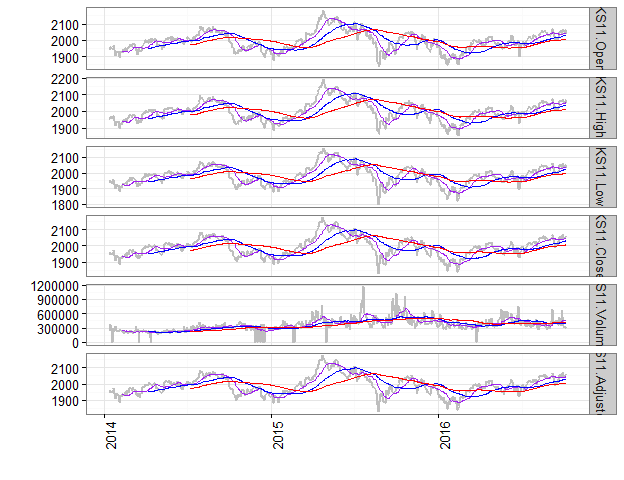

# kyoboLT package in R


# `kyoboLT` package in R 

<br><br>

Useful R package for kyobo retirement pension marketing team.  

# install `kyoboLT` package


```r
devtools::install_github("lovetoken/kyoboLT")
```

# Useful functions for time series data

## `xdiff_returns()`


```r
data(sample_index)
sample_index
```

```
##            Fund_1 Fund_2 Fund_3
## 2013-10-23 1048.2  955.7 1046.4
## 2013-10-24 1128.9  924.3  968.7
## 2013-10-25  977.3 1081.2  969.0
## 2013-10-26 1129.8  980.0 1118.1
## 2013-10-27  858.1 1002.0 1033.0
## 2013-10-28 1048.5  905.1  928.7
## 2013-10-29  916.4  927.9  980.2
## 2013-10-30  948.6  887.1 1005.9
## 2013-10-31  885.3  932.0 1041.2
## 2013-11-01  997.3  914.0 1024.0
## 2013-11-02 1137.6 1048.3 1012.6
## 2013-11-03  886.7  958.9 1075.6
## 2013-11-04 1055.3 1091.6  955.2
## 2013-11-05  889.9  960.0  961.2
## 2013-11-06 1008.6 1014.7  967.6
## 2013-11-07  995.1 1016.8  947.5
## 2013-11-08 1054.9 1027.5  984.9
## 2013-11-09 1022.1  905.0  950.7
## 2013-11-10  962.7 1011.5 1046.1
## 2013-11-11 1050.3 1131.9 1081.9
```

```r
# basic 3 day returns
xdiff_returns(sample_index, 3)
```

```
##                  Fund_1       Fund_2       Fund_3
## 2013-10-26  0.077847739  0.025426389  0.068520642
## 2013-10-27 -0.239879529  0.084063616  0.066377619
## 2013-10-28  0.072853781 -0.162874584 -0.041589267
## 2013-10-29 -0.188882988 -0.053163265 -0.123334228
## 2013-10-30  0.105465563 -0.114670659 -0.026234269
## 2013-10-31 -0.155650930  0.029720473  0.121137073
## 2013-11-01  0.088280227 -0.014980063  0.044684758
## 2013-11-02  0.199240987  0.181715703  0.006660702
## 2013-11-03  0.001581385  0.028862661  0.033038801
## 2013-11-04  0.058157024  0.194310722 -0.067187500
## 2013-11-05 -0.217739100 -0.084231613 -0.050760419
## 2013-11-06  0.137476035  0.058191678 -0.100409074
## 2013-11-07 -0.057045390 -0.068523269 -0.008061139
## 2013-11-08  0.185414091  0.070312500  0.024656679
## 2013-11-09  0.013384890 -0.108110772 -0.017465895
## 2013-11-10 -0.032559542 -0.005212431  0.104063325
## 2013-11-11 -0.004360603  0.101605839  0.098487156
```

```r
# calculation 3 day log returns
xdiff_returns(sample_index, 3, log.returns = T)
```

```
##                  Fund_1       Fund_2       Fund_3
## 2013-10-26  0.074966219  0.025108515  0.066275114
## 2013-10-27 -0.274278343  0.080716587  0.064267503
## 2013-10-28  0.070322183 -0.177781380 -0.042478853
## 2013-10-29 -0.209342954 -0.054628603 -0.131629463
## 2013-10-30  0.100266571 -0.121795566 -0.026584527
## 2013-10-31 -0.169189280  0.029287380  0.114343414
## 2013-11-01  0.084598677 -0.015093397  0.043715173
## 2013-11-02  0.181688846  0.166967368  0.006638617
## 2013-11-03  0.001580136  0.028453979  0.032504751
## 2013-11-04  0.056528738  0.177569217 -0.069551063
## 2013-11-05 -0.245566962 -0.087991799 -0.052094056
## 2013-11-06  0.128811803  0.056561487 -0.105815146
## 2013-11-07 -0.058737131 -0.070984069 -0.008093806
## 2013-11-08  0.170092158  0.067950662  0.024357609
## 2013-11-09  0.013296104 -0.114413338 -0.017620223
## 2013-11-10 -0.033101398 -0.005226063  0.098997305
## 2013-11-11 -0.004370138  0.096768969  0.093933921
```

```r
# not omit about start time index
xdiff_returns(sample_index, 3, start.omit = F)
```

```
##                  Fund_1       Fund_2       Fund_3
## 2013-10-23           NA           NA           NA
## 2013-10-24           NA           NA           NA
## 2013-10-25           NA           NA           NA
## 2013-10-26  0.077847739  0.025426389  0.068520642
## 2013-10-27 -0.239879529  0.084063616  0.066377619
## 2013-10-28  0.072853781 -0.162874584 -0.041589267
## 2013-10-29 -0.188882988 -0.053163265 -0.123334228
## 2013-10-30  0.105465563 -0.114670659 -0.026234269
## 2013-10-31 -0.155650930  0.029720473  0.121137073
## 2013-11-01  0.088280227 -0.014980063  0.044684758
## 2013-11-02  0.199240987  0.181715703  0.006660702
## 2013-11-03  0.001581385  0.028862661  0.033038801
## 2013-11-04  0.058157024  0.194310722 -0.067187500
## 2013-11-05 -0.217739100 -0.084231613 -0.050760419
## 2013-11-06  0.137476035  0.058191678 -0.100409074
## 2013-11-07 -0.057045390 -0.068523269 -0.008061139
## 2013-11-08  0.185414091  0.070312500  0.024656679
## 2013-11-09  0.013384890 -0.108110772 -0.017465895
## 2013-11-10 -0.032559542 -0.005212431  0.104063325
## 2013-11-11 -0.004360603  0.101605839  0.098487156
```

## `tmplot()`

Time series and (3 lines) moving average plot about all fund items


```r
library("quantmod")
data <- getSymbols("^ks11", from=Sys.Date()-1000, to = Sys.Date(), auto.assign = F)

tmplot(data)
```



## `efff()`

Efficient Frontier using excess earning rate


```r
returns <- xdiff_returns(sample_index, 1)
efff(returns, rg = 0.01039, rfr = 0.001)
```


```
##                         Method    Fund_1    Fund_2    Fund_3    Std_Dev
## 6963 Returns of goal Portfolio 0.1762689 0.7062416 0.1174895 0.07242801
## 3732         Optimal Portfolio 0.1666427 0.4980280 0.3353293 0.05605683
##      Excess_Return    sharpe
## 6963   0.010389703 0.1434487
## 3732   0.008422577 0.1502507
```

# Useful manipulation

## `mmadjust()`

Adjust min & max about numeric vector


```r
(x <- c(NA, 1:100*.01, NA))
```

```
##   [1]   NA 0.01 0.02 0.03 0.04 0.05 0.06 0.07 0.08 0.09 0.10 0.11 0.12 0.13
##  [15] 0.14 0.15 0.16 0.17 0.18 0.19 0.20 0.21 0.22 0.23 0.24 0.25 0.26 0.27
##  [29] 0.28 0.29 0.30 0.31 0.32 0.33 0.34 0.35 0.36 0.37 0.38 0.39 0.40 0.41
##  [43] 0.42 0.43 0.44 0.45 0.46 0.47 0.48 0.49 0.50 0.51 0.52 0.53 0.54 0.55
##  [57] 0.56 0.57 0.58 0.59 0.60 0.61 0.62 0.63 0.64 0.65 0.66 0.67 0.68 0.69
##  [71] 0.70 0.71 0.72 0.73 0.74 0.75 0.76 0.77 0.78 0.79 0.80 0.81 0.82 0.83
##  [85] 0.84 0.85 0.86 0.87 0.88 0.89 0.90 0.91 0.92 0.93 0.94 0.95 0.96 0.97
##  [99] 0.98 0.99 1.00   NA
```

```r
mmadjust(x, .2, .8)
```

```
##   [1]   NA 0.20 0.20 0.20 0.20 0.20 0.20 0.20 0.20 0.20 0.20 0.20 0.20 0.20
##  [15] 0.20 0.20 0.20 0.20 0.20 0.20 0.20 0.21 0.22 0.23 0.24 0.25 0.26 0.27
##  [29] 0.28 0.29 0.30 0.31 0.32 0.33 0.34 0.35 0.36 0.37 0.38 0.39 0.40 0.41
##  [43] 0.42 0.43 0.44 0.45 0.46 0.47 0.48 0.49 0.50 0.51 0.52 0.53 0.54 0.55
##  [57] 0.56 0.57 0.58 0.59 0.60 0.61 0.62 0.63 0.64 0.65 0.66 0.67 0.68 0.69
##  [71] 0.70 0.71 0.72 0.73 0.74 0.75 0.76 0.77 0.78 0.79 0.80 0.80 0.80 0.80
##  [85] 0.80 0.80 0.80 0.80 0.80 0.80 0.80 0.80 0.80 0.80 0.80 0.80 0.80 0.80
##  [99] 0.80 0.80 0.80   NA
```

## `trim()`

Trimming of whitespace in character


```r
trim("  Wow!  ", method = "leading")
```

```
## [1] "Wow!  "
```

```r
trim("  Wow!  ", method = "trailing")
```

```
## [1] "  Wow!"
```

```r
"  Wow!  " %>% trim %>% trim(method = "leading")
```

```
## [1] "Wow!"
```
